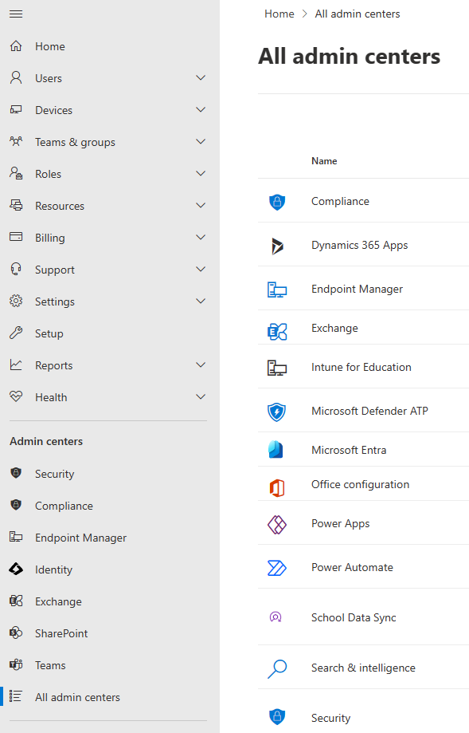

# Microsoft 365 Admin Center

### Centralized Management for Microsoft 365 Services

---

## MS365 Admin Center

- Web-based portal for managing Microsoft 365 subscriptions and services.

- Provides a unified (*really?*) interface for
  - user administration,
  - licensing,
  - security,
  - service health monitoring.
  
- **Entry point** for accessing additional specialized admin centers.

 

---

## Core Functions of the Admin Center(s)

- **User Management:**
  - Add, remove, and modify accounts. Assign licenses, reset passwords, and manage user groups.
- **Domain Management:**
  - Configure custom domains associated with MS365 tenant for email and other services.
- **Device Management:**
  - Manage devices enrolled in your MS365 mobile device management (MDM) program.
- **Billing Management:**
  - Subscription details, purchase licenses, payment information, and invoices.

---

## Specialized Admin Centers <small>1/2</small>

- **[Microsoft Entra Admin Center (Identity)](https://entra.microsoft.com/)**: (*Azure Active Directory Admin Center*) Manage identities, groups, permissions, and network access.

-  **[Exchange Admin Center](https://admin.exchange.microsoft.com)**: Controls over email services like mailboxes, distribution groups, email flow rules, and anti-spam settings.

---

## Specialized Admin Centers <small>2/2</small>

-  **[Teams Admin Center](https://admin.teams.microsoft.com)**:  Configuration of MS Teams settings, including team creation, channel management, calling policies, and meeting functionalities.

-  **[SharePoint Admin Center](https://YOURTENANT-admin.sharepoint.com/)**: Centralized management of SharePoint sites, permissions, storage quotas (OneDrive), and configurations for specific SharePoint sites.

-  **[Security](https://security.microsoft.com) & [Compliance Center (Purview)](https://compliance.microsoft.com)**:  Tools for managing organizational security policies, data retention settings, threat protection configurations, and adherence to industry compliance regulations.

---

## Choosing the Right Admin Center for the Task

- **User provisioning, licensing, password resets:** Microsoft 365 admin center
- **Mailbox configuration, email rules, anti-spam settings:** Exchange Admin Center
- **Creating and managing SharePoint sites, permissions, storage:** SharePoint Admin Center
- **Configuring Teams, managing channels, call policies:** Teams Admin Center
- **Security policies, data retention, threat protection, compliance:** Security and Compliance Center

---

## MS Learn - Platform

- [Documentation - Microsoft Entra | Microsoft Learn](https://learn.microsoft.com/entra/)

  - [Microsoft Entra ID | Microsoft Learn](https://learn.microsoft.com/entra/identity/)
  - [Exchange Online | Microsoft Learn](https://learn.microsoft.com/exchange/exchange-online)
  - [SharePoint and OneDrive | Microsoft Learn](https://learn.microsoft.com/sharepoint/introduction)

  - [Microsoft Teams | Microsoft Learn](https://learn.microsoft.com/microsoftteams/)
  - [Microsoft Purview | Microsoft Learn](https://learn.microsoft.com/purview/)
  - [Microsoft - Security | Microsoft Learn](https://learn.microsoft.com/security/)

- BONUS - MS Graph: [Microsoft Graph | Microsoft Learn](https://learn.microsoft.com/graph/)

---

## Add-on Pricing

- P2-Plan: [Plans and Prices for Microsoft Entra | Microsoft Security](https://www.microsoft.com/security/business/microsoft-entra-pricing) 
